## Advanced Lane Finding

In this project, my goal is to write a software pipeline to identify the lane boundaries in a video.

### Project Architecture

1. Images of chessboard are located in the folder camera_cal
2. Images for report are in the folder report
3. All python scripts are in the folder scripts
4. The notebook [P4](P4.iypnb) 

The Project
---

The goals / steps of this project are the following:

1. Camera calibration - Compute the camera calibration matrix and distortion coefficients given a set of chessboard images.
2. Apply a distortion correction to raw images.
3. Color & Gradient Thresholding - Use color transforms, gradients, etc., to create a thresholded binary image.
4. Perspective Transformation - Apply a perspective transform to rectify binary image ("birds-eye view").
5. Detection and fitting of the left and right lane - Detect lane pixels and fit to find the lane boundary.
6. Curvature of lanes and vehicle position - Determine the curvature of the lane and vehicle position with respect to center.
7.  Warp and putting the information together - Warp the detected lane boundaries back onto the original image.
8. Video - Output visual display of the lane boundaries and numerical estimation of lane curvature and vehicle position.
9. Discussion
The images for camera calibration are stored in the folder called `camera_cal`.  The images in `test_images` are for testing your pipeline on single frames.  If you want to extract more test images from the videos, you can simply use an image writing method like `cv2.imwrite()`, i.e., you can read the video in frame by frame as usual, and for frames you want to save for later you can write to an image file.  

To help the reviewer examine your work, please save examples of the output from each stage of your pipeline in the folder called `ouput_images`, and include a description in your writeup for the project of what each image shows.    The video called `project_video.mp4` is the video your pipeline should work well on.  

The `challenge_video.mp4` video is an extra (and optional) challenge for you if you want to test your pipeline under somewhat trickier conditions.  The `harder_challenge.mp4` video is another optional challenge and is brutal!

If you're feeling ambitious (again, totally optional though), don't stop there!  We encourage you to go out and take video of your own, calibrate your camera and show us how you would implement this project from scratch!

## 1. Camera Calibration
The first issue we have to tackle is the camera calibration. This is caused by the lense of the camera. To remember: the camera lense is mapping an 3D world to a 2D image. The used transformation is not always perfect. This has to the consequence that the shape and size of the 3D objects is changed through the distortion. Through the camera calibration we want to correct the distortion and extract more useful information.

In a nutshell, the taken image of the camera changes the shape and size of the objects and we want to correct the distortion.

In order to fix this we need pictures of known shapes and then we can correct the distortion erros. An image of a chessboard is great for calibration because of the high contrast of the fields, we easily can detect patterns. For the project there are 20 chessboard images provided from different angles. This makes it easy to detect any distortion, because of the different size and shape of the squares in these images.

The whole process can be easily described by looking at the following picture.

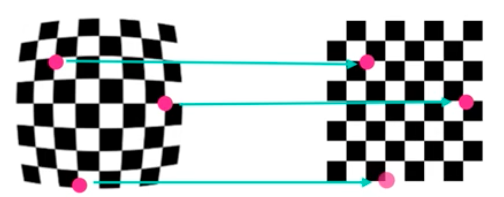

1. We need to find "object points". These points are the coordinates (x,y,z) of the chessboard corners. Luckily opencv provides a function called [cv2.findChessboardCorners()](http://docs.opencv.org/2.4/modules/calib3d/doc/camera_calibration_and_3d_reconstruction.html#findchessboardcorners) to detect the corners automatically. 
2. After we found the "object points" which are 3D points we need to map them to a 2D image plane. Then we can use the function [cv2.calibrateCamera()](http://docs.opencv.org/2.4/modules/calib3d/doc/camera_calibration_and_3d_reconstruction.html#calibratecamera) to the compute the camera calibration and distortio coefficients.
3. We apply the computed distortion coefficients by using [cv2.undistort](http://docs.opencv.org/2.4/modules/imgproc/doc/geometric_transformations.html#void undistort(InputArray src, OutputArray dst, InputArray cameraMatrix, InputArray distCoeffs, InputArray newCameraMatrix)) and see the result:

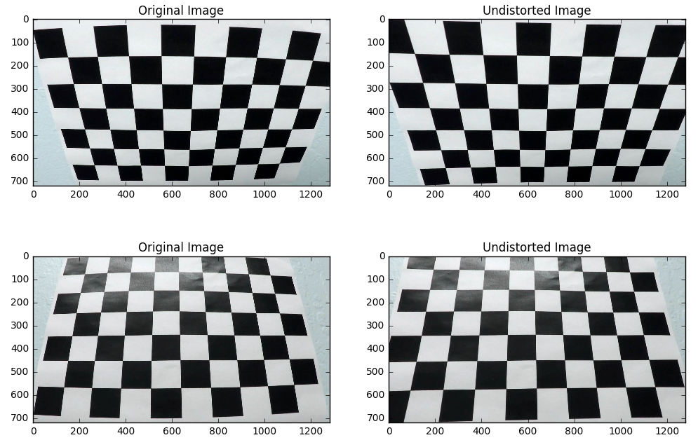

The code can be seen in [distortion.py](scripts/distortion.py)

## 2. Applied camera calibration on road images

## 3. Color & Gradient Thresholding
Another issue we have to tackle is the information extraction of the road. This means to exclude the pixels which define the background. For example, we don't care about trees and other cars at the moment.

In order to achieve a useful information extraction of the road we need to filter out pixels of the image which we don't care in general. I used a combination of color and gradient thresholding to extract the important features of the image.

For the color extraction I changed the representation of the image from RGB to HLS. HLS described hue, luminosity and saturation of the image. I used different threshold to filter the pixels for hue and saturation. 

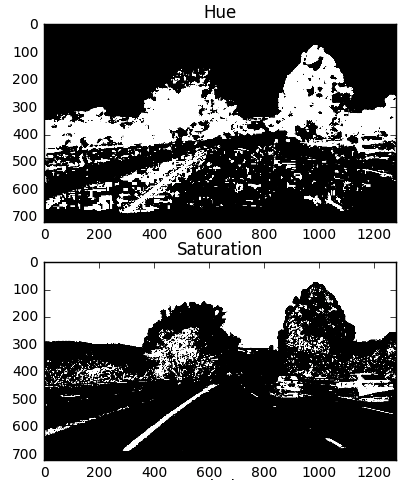

For the gradient extraction I changed the representation of the image from RGB to GRAY. I applied the techniques sobe operator, magnitude and direction of the gradient to the gray image.

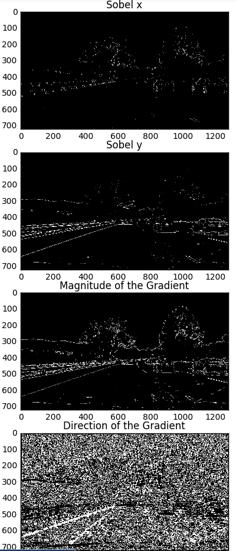

Furthermore I combined the sobel operator, magnitude and direction of the gradient into one image.

In the last step, I combined the hue and saturation image with the combined gradient image. The result of this step is following:

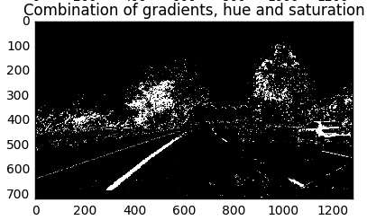

The code can be seen in [extraction.py](scripts/extraction.py)

## 4. Perspective Transformation
In this we want to transform the image from 3D to a 2D perspective. The image will be represented as a bird views of the road.
Before the transformation I also will reduce the region of interest to achieve a better result. The can be seen in [region_of_interest.py](scripts/region_of_interest.py)

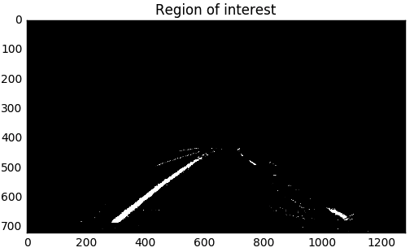

### Birds View
For the transformation I picked four points of the 3D image and mapped them on a 2D image. This was an trial and error approached and after some time it worked successfully. I used the function cv2.getPerspectiveTransform() to calculate the matrix for the 3D to 2D transformation. After I computed the matrix I used the function cv2.warpPerspective() to create the birds view perspective. The whole code can be read in the script [perspective.py](scripts/perspective.py).

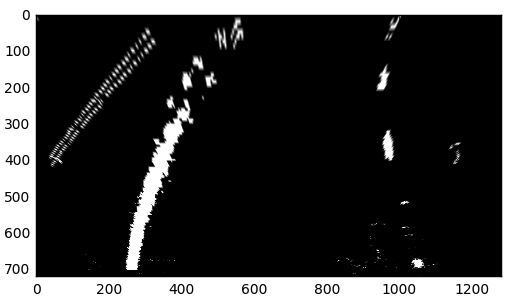

## 5. Detection and fitting of the left and right lane
The next step is to think about how we can create lines which show the shape of the road on the birds view image. Before diving into the details, I analyzed the birds view image with an histogram

We can see a huge peak of the histogram at an certain point. This information can be used to draw an lane through these points. I am using an second ordered polynomial to fit the lane. The relevant points of the birds view image are extracted by an sliding window to fit the polynomial.

For the sliding window we define an height and width. Also we set a number of windows. At the beginning we identify the base of the left and right side. Then we iterate through number of windows and change position of the window to get the smallest amount of zero pixels. The result is the following:

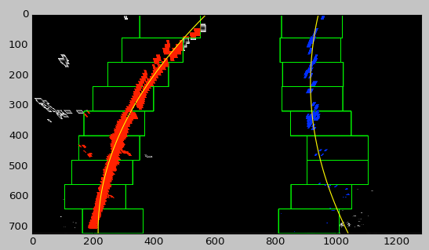

The code can be seen in [sliding.py](scripts/sliding.py).

## 6. Curvature of lanes and vehicle position
The next step is to compute the radius of curvature of the fit. An awesome tutorial about this topic can be seen [here](http://www.intmath.com/applications-differentiation/8-radius-curvature.php) 

The radius of curvature is nothing else than a "kiss" between a circle and a curve. The "kiss" is described as a tangent where the 2 curves met. The following image is cited from the [tutorial](http://www.intmath.com/applications-differentiation/8-radius-curvature.php).

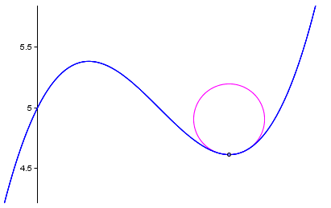

The radius of curvature is calculated by the following formula:

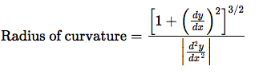

This formula is applied for both lines as well as the bottom of the image to calculate the offset of the car.

Also since we want to calculate the length in meters we will define a meter in x dimension as 3.7/700 and in y dimension 30/720.

To calculate the offset from the car I decided that the camera is in the center of the image which is 640. Then I used the following formula: 

**((Left_line + Right_line) / 2 - 640) * x_dimension**

* Left_line and Right_line are polynomials
* 640 is the center of image
* x_dimension is a meter in pixel value

The code can be seen in [curvature.py](scripts/curvature.py).

## 7. Warp and putting the information together

There was a lot of information computed in the birds view and we want to put the information back to the real image. In order to achieve this we have to compute the inverse of the matrix which was computed for the 3D to 2D transformation. This is done by switching the src and dist in the function **cv2.getPerspectiveTransform()**. The code for this part can be seen in the **get_matrix_for_brids_view_to_3d()** function at the [perspective.py](scripts/perspective.py) file.

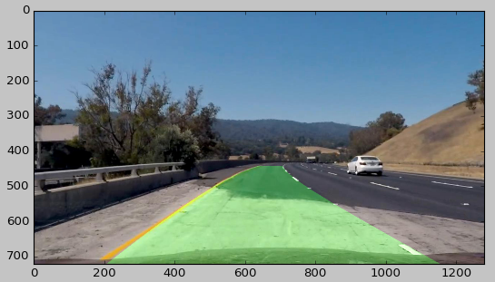

In order to put the whole information together I decided to create a new picture consisting of several small images. The code for this can be seen from Line 47-72 in the script [pipeline.py](pipeline.py).

The final result:

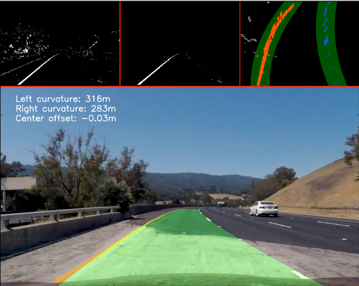

## 8. Video

Until this point we only had one image processed step by step. I used the pipeline function in [pipeline.py](pipeline.py) to create video with the moviepy library. The video can be found in repository. ([video](project_video_advanced.mp4))

You also can view the video [here](https://youtu.be/tb0gQOy4oTo).

## 9. Discussion

I think it did a good job for this project. I am mostly satisfied with the result. However, I have to points where I am not satisfied at the moment:

1. The left curvature is not accurate enough. Sometimes the left curvature has a really high value. I guess that this is depend on the amount lane points. I am still looking to fix this.
2. Sometimes the insert poly on the road does to heavy changes. I am looking for a not so radical update method here.