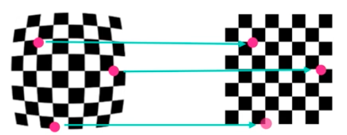
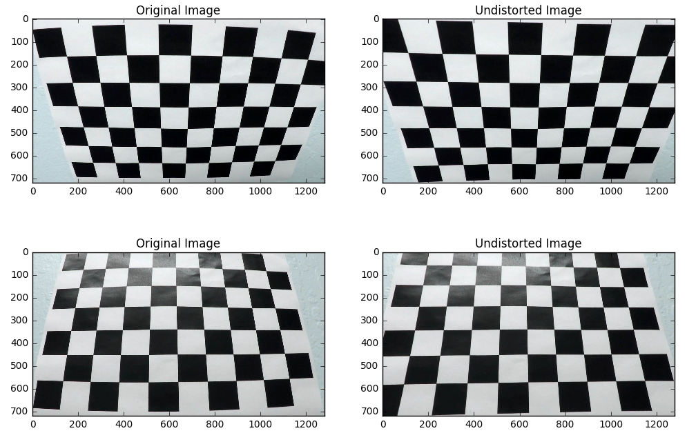
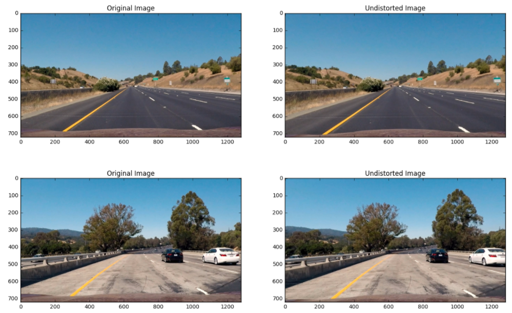
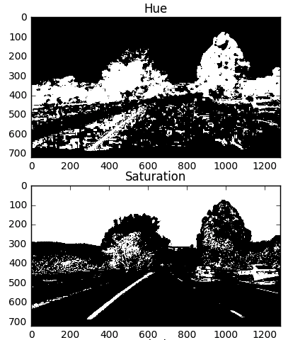
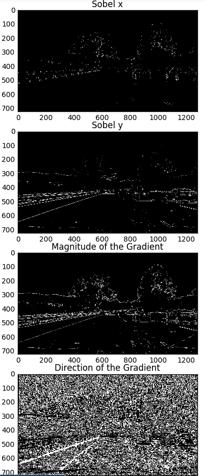
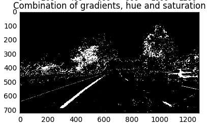

## Advanced Lane Finding

In this project, my goal is to write a software pipeline to identify the lane boundaries in a video.

The Project
---

The goals / steps of this project are the following:

1. Camera calibration Compute the camera calibration matrix and distortion coefficients given a set of chessboard images.
2. Apply a distortion correction to raw images.
3. Use color transforms, gradients, etc., to create a thresholded binary image.
4. Apply a perspective transform to rectify binary image ("birds-eye view").
5. Detect lane pixels and fit to find the lane boundary.
6. Determine the curvature of the lane and vehicle position with respect to center.
7. Warp the detected lane boundaries back onto the original image.
8. Output visual display of the lane boundaries and numerical estimation of lane curvature and vehicle position.

The images for camera calibration are stored in the folder called `camera_cal`.  The images in `test_images` are for testing your pipeline on single frames.  If you want to extract more test images from the videos, you can simply use an image writing method like `cv2.imwrite()`, i.e., you can read the video in frame by frame as usual, and for frames you want to save for later you can write to an image file.  

To help the reviewer examine your work, please save examples of the output from each stage of your pipeline in the folder called `ouput_images`, and include a description in your writeup for the project of what each image shows.    The video called `project_video.mp4` is the video your pipeline should work well on.  

The `challenge_video.mp4` video is an extra (and optional) challenge for you if you want to test your pipeline under somewhat trickier conditions.  The `harder_challenge.mp4` video is another optional challenge and is brutal!

If you're feeling ambitious (again, totally optional though), don't stop there!  We encourage you to go out and take video of your own, calibrate your camera and show us how you would implement this project from scratch!

## 1. Camera Calibration
The first issue we have to tackle is the camera calibration. This is caused by the lense of the camera. To remember: the camera lense is mapping an 3D world to a 2D image. The used transformation is not always perfect. This has to the consequence that the shape and size of the 3D objects is changed through the distortion. Through the camera calibration we want to correct the distortion and extract more useful information.

In a nutshell, the taken image of the camera changes the shape and size of the objects and we want to correct the distortion.

In order to fix this we need pictures of known shapes and then we can correct the distortion erros. An image of a chessboard is great for calibration because of the high contrast of the fields, we easily can detect patterns. For the project there are 20 chessboard images provided from different angles. This makes it easy to detect any distortion, because of the different size and shape of the squares in these images.

The whole process can be easily described by looking at the following picture.

1. We need to find "object points". These points are the coordinates (x,y,z) of the chessboard corners. Luckily opencv provides a function called [cv2.findChessboardCorners()](http://docs.opencv.org/2.4/modules/calib3d/doc/camera_calibration_and_3d_reconstruction.html#findchessboardcorners) to detect the corners automatically. 
2. After we found the "object points" which are 3D points we need to map them to a 2D image plane. Then we can use the function [cv2.calibrateCamera()](http://docs.opencv.org/2.4/modules/calib3d/doc/camera_calibration_and_3d_reconstruction.html#calibratecamera) to the compute the camera calibration and distortio coefficients.
3. We apply the computed distortion coefficients by using [cv2.undistort](http://docs.opencv.org/2.4/modules/imgproc/doc/geometric_transformations.html#void undistort(InputArray src, OutputArray dst, InputArray cameraMatrix, InputArray distCoeffs, InputArray newCameraMatrix)) and see the result:

The code can be seen in [distortion.py](scripts/distortion.py)

## 2. Applied camera calibration on road images

## 3. Color & Gradient Thresholding
Another issue we have to tackle is the information extraction of the road. This means to exclude the pixels which define the background. For example, we don't care about trees and other cars at the moment.

In order to achieve a useful information extraction of the road we need to filter out pixels of the image which we don't care in general. I used a combination of color and gradient thresholding to extract the important features of the image.

For the color extraction I changed the representation of the image from RGB to HLS. HLS described hue, luminosity and saturation of the image. I used different threshold to filter the pixels for hue and saturation. 

For the gradient extraction I changed the representation of the image from RGB to GRAY. I applied the techniques sobe operator, magnitude and direction of the gradient to the gray image.

Furthermore I combined the sobel operator, magnitude and direction of the gradient into one image.

In the last step, I combined the hue and saturation image with the combined gradient image. The result of this step is following:

